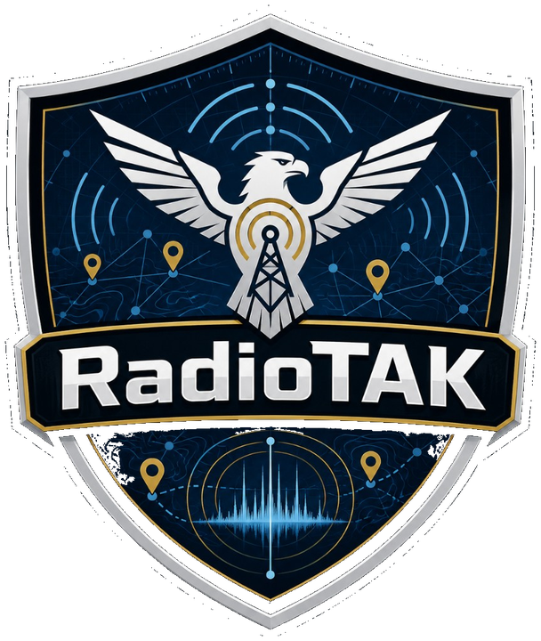
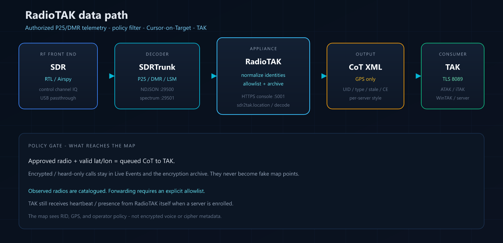
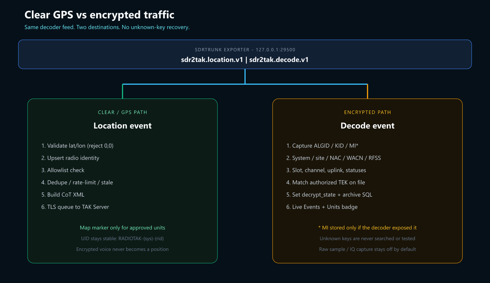
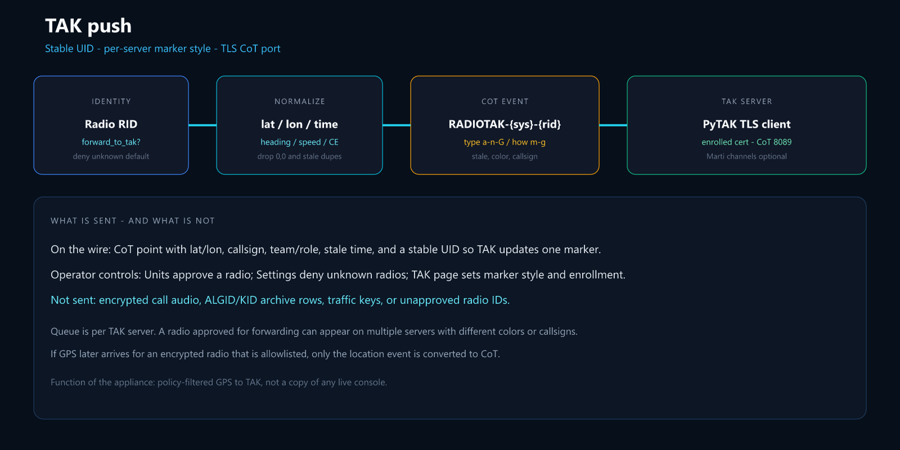

<p align="center">
  
</p>

# RadioTAK

Appliance console for authorized radio-system location telemetry → TAK Server.

One clone. One password. One URL. Manage everything from your browser.

**Current version:** see [`VERSION`](VERSION)

## What Is This?

RadioTAK is an infra-TAK-style management console (Raspberry Pi 5 or Debian/Proxmox) that:

- Installs with a single command and serves a password-protected HTTPS UI (`:5001`)
- Discovers USB SDRs, writes an SDRTrunk playlist, and decodes P25/DMR control channels
- Shows a live spectrum waterfall, hearing gauges, and pipeline health on the Console
- Observes every radio the decoder hears (GPS **and** encrypted/clear calls)
- Forwards **allowlisted** radio GPS as Cursor-on-Target (CoT) to one or more TAK Servers
- Archives encryption metadata (ALGID, KID, site, NAC/WACN, optional MI, identifier context) without recovering unknown keys
- Updates from GitHub, joins Tailscale, and customizes logo/banner from the UI

> **Scope:** Only radio systems and subscriber units you own, administer, or are explicitly authorized to monitor. Unknown radios are observed but **not** forwarded by default. Encrypted traffic is never turned into a fake map point.

## How it works

RadioTAK does not reimplement P25. SDRTrunk demodulates the control channel. The CopIXus exporter streams NDJSON to RadioTAK. RadioTAK decides what is allowed to become CoT.

<p align="center">
  
</p>

**GPS path** — a radio reports lat/lon → identity + allowlist + dedupe → CoT XML → TLS to TAK.

**Encrypted path** — a call is flagged encrypted → ALGID/KID (and MI if the decoder had it) are archived → Live Events / Units show a badge → TAK is unchanged unless that radio later sends GPS *and* is approved.

<p align="center">
  
</p>

<p align="center">
  
</p>

More detail: [docs/ARCHITECTURE.md](docs/ARCHITECTURE.md) · [docs/ENCRYPTION-ARCHIVE.md](docs/ENCRYPTION-ARCHIVE.md) · [docs/SDRTRUNK.md](docs/SDRTRUNK.md)

## Features

| Area | What you get |
|------|----------------|
| Console | Pipeline strip (SDR → decoder → locations → TAK), CPU/RAM/disk, hearing gauges, waterfall + Listen, authorized map |
| SDR | Tuner discovery, control-channel playlists, Listen/Stop, browser talkgroup audio, noVNC to the native decoder GUI |
| Live Events | GPS queues, blocked reports, encrypted/clear calls with cipher + KID |
| Units | Observed vs approved, GPS filter, TAK marker overrides |
| TAK | Enrollment, PKCS#12 import, per-server marker style, Marti channels, test CoT |
| Encryption archive | Filterable history, ALGID/KID/site stats, capture sessions, CSV/JSON/JSONL export (no key material) |
| Traffic keys | Store authorized TEKs (AES-256, AES-128, DES-OFB, ADP). Match heard ALGID+KID. Hex never shown again |
| Policy | Observe every radio; forward only allowlisted GPS; encrypted calls never become map points |
| Ops | Alerts, Tailscale, one-click GitHub update, diagnostics ZIP, retention |

## Quick Start (Raspberry Pi OS 64-bit)

```bash
curl -fsSL https://raw.githubusercontent.com/CopIXus/RadioTAK/main/install.sh | sudo bash
```

The same installer runs on **Debian 12/13 amd64**, including a Proxmox KVM VM with USB SDR passthrough — see [docs/INSTALL-DEBIAN-PROXMOX.md](docs/INSTALL-DEBIAN-PROXMOX.md). Use that when a Pi is CPU-bound.

The installer will:

1. Detect Debian/Raspberry Pi OS 64-bit
2. Install Python dependencies
3. Ask you to set an admin username and password (from the terminal, even when piped via `curl | sudo bash`)
4. Start the HTTPS console on port **5001**

Then open `https://<pi-ip>:5001` and log in. If the installer had no terminal, first visit creates the admin account.

After login: Marketplace → **SDR Location Gateway** → SDR page → enter authorized **control-channel** MHz → Listen → approve units that have GPS before they appear on TAK.

## Updating

From the web UI: **System → Update Now**

Or over SSH:

```bash
sudo radiotak update
```

Your config, certificates, and database live in `/var/lib/radiotak/` and are never overwritten by updates.

### Universal recovery (SSH)

```bash
cd $(grep -oP 'WorkingDirectory=\K.*' /etc/systemd/system/radiotak.service)
git -c safe.directory=/opt/radiotak fetch https://github.com/CopIXus/RadioTAK.git main
git -c safe.directory=/opt/radiotak checkout --force -B main FETCH_HEAD
sudo systemctl restart radiotak
```

## Reset password

```bash
sudo radiotak reset-password
```

## Development (Windows / Linux)

```bash
python -m venv .venv
# Windows:
.venv\Scripts\activate
# Linux:
# source .venv/bin/activate
pip install -r requirements.txt
set RADIOTAK_DATA_DIR=.data
python -m radiotak.main
```

Open `https://127.0.0.1:5001` (self-signed cert).

## Replay fixtures (no RF)

```bash
radiotak replay tests/fixtures/p25_motorola_gps.jsonl
radiotak replay tests/fixtures/encryption/p25_des_metadata.jsonl
```

## Marketplace modules

| Module | Status |
|--------|--------|
| SDR Location Gateway | P25/DMR GPS + call metadata via SDRTrunk → TAK / archive |
| Zello Audio Bridge | Coming soon — talkgroup audio → Zello Channel API |

## License

MIT (see [LICENSE](LICENSE)). The optional SDRTrunk fork remains GPLv3.
