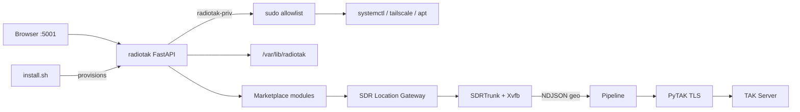

# RadioTAK Architecture

## Product shape

RadioTAK is a **single-service appliance**: one clone, one systemd unit (`radiotak`), one password, one HTTPS port (`:5001`). That deployment shape is deliberate — it makes "no more SSH" possible for day-to-day ops while still allowing Tailscale/SSH for recovery.

- **Universal recovery** is `git fetch && git checkout` (see README). No container rebuild for the console itself.
- **All state** lives outside the git checkout in `/var/lib/radiotak/` so updates never clobber config.
- **Modules** (SDR Location Gateway, Zello Audio Bridge, …) are optional packages installed from the Marketplace; they register routers and systemd units.

## Big picture



## Core packages

| Package | Role |
|---------|------|
| `radiotak.auth` | Argon2id passwords, signed sessions, CSRF, login rate-limit |
| `radiotak.db` | SQLAlchemy models + Alembic migrations (SQLite WAL) |
| `radiotak.web` | Jinja2 templates, routers, static assets, help system |
| `radiotak.services` | settings, updater, tailscale, system, retention, modules, secrets, diagnostics |
| `radiotak.gateway` | location schema, normalizer, identities, CoT, TAK connection/enrollment |
| `radiotak.platform` | Linux impl vs. Windows/dev stub |

## Module contract

Each module under `modules/<id>/` provides:

- `module.json` — catalog metadata (name, description, version, requires, status)
- `install.sh` / `uninstall.sh` — run via `radiotak-priv`
- optional `router.py` — FastAPI `APIRouter` mounted when installed
- optional templates under `templates/`

## Data paths

```text
/opt/radiotak/                 # git checkout (code)
/var/lib/radiotak/
  auth.json                    # admin hash
  settings.json                # theme, retention, bind, etc.
  radiotak.db                  # SQLite WAL
  secrets/                     # 0700 — certs, keys, zello JWT material
  logs/                        # JSONL rotated logs
  modules/                     # installed-module state markers
```

## Security boundaries

- Console runs as user `radiotak` (non-root).
- Privileged actions only through `bin/radiotak-priv <subcommand>` (sudoers allowlist).
- No arbitrary shell from the UI.
- Secrets never returned by GET APIs; never logged.
- Management UI bound to LAN by default; Tailscale for remote.

## Pipeline (location → TAK)

```text
decoder event → schema validation → normalize → radio identity
  → deny unknown → dedupe / rate-limit → CoT → per-server queue → TLS send
```

## Related docs

- [INSTALL-RPI.md](INSTALL-RPI.md)
- [INSTALL-DEBIAN-PROXMOX.md](INSTALL-DEBIAN-PROXMOX.md)
- [TAK-ENROLLMENT.md](TAK-ENROLLMENT.md)
- [SDRTRUNK.md](SDRTRUNK.md)
- [SECURITY.md](SECURITY.md)
- [HARDWARE.md](HARDWARE.md)
